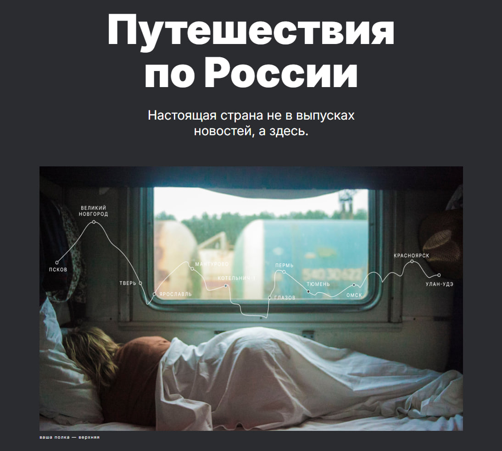

# Путешествия по России
В этом проекте я полностью перепрохожу уже когда-то пройденный материал с целью повторения материала. Проект будет постепенно пополняться, чтобы каждый день у меня была хоть какая-то активность на GitHub и Git. Параллельно ему будут создаваться еще проекты, над которыми я тоже буду каждый день по немногу работать.

Чем отличается этот проект, от когда-то сделанного? Тут я применяю технологию Git во всей его силе, проходя книгу и самообучаясь. Следовательно, помимо повторения вёрстки и программирования, я буду обучаться и гиту.

<div align="center" ></div>

## Содержание
- [Технологии](#технологии)
- [Начало работы](#начало-работы)
- [Тестирование](#тестирование)
- [Deploy и CI/CD](#deploy-и-ci/cd)
- [Contributing](#contributing)
- [To do](#to-do)
- [Команда проекта](#команда-проекта)

## Технологии
- Grid Laout
- BEM
- Модульность проекта

## Использование
Для установки всех папок и файлов локально, чтобы поковыряться в моём проекте:
```sh
$ git clone https://github.com/Shekko777/travel-repetition.git
```

## FAQ 
- Как часто будут выходить обновления?
- Обновления будут выходить раз в день, но малыми порцыями.

- Будет ли сайт полноценным сайтом?
- Нет. Это лишь макет для тренировки. После релиза, возможно, удалю.

- Будут ли обучающие материалы, как делать такие же сайты?
- Нет. Я не обучатор. И не буду выливать платные курсы в сеть.

### Почему этот проект?
Я его когда-то проходил на учебе. А чтобы что-то вспомнить, идеальнее всего подойдет что-то старое и знакомое. В дальнейшем я буду работать уже над новыми проектами.

## To do
- [x] Сделать вёрстку
- [x] Сделать README.md
- [x] Задеплоить сайт
- [ ] Адаптив header
- [ ] Адаптив footer
- [ ] Адаптив main

## Команда проекта

- TG [Иван Першин](tg://resolve?domain=ShekkoWeb) — CEO и главный разработчик проекта
